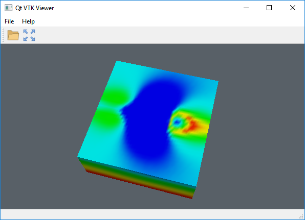

# Qt-VTK-viewer
A CMake/C++ project for embedding a VTK 3D view in a Qt window.

## Prerequisites
- Qt 5.x downloaded.
- VTK 9.x source downloaded & compiled. See [Build-VTK.md](doc/Build-VTK.md) for a guide to compile VTK.

## Usage
1. Clone or download this repository.
2. Open CMakeLists.txt in Qt Creator.
3. Configure project.
	1. Set build directory.
	2. Specify VTK_DIR.
4. Build project.

Done. Happy coding :)

## License
This project is licensed under the Apache License 2.0 - see the [LICENSE](LICENSE) file for details.

## Acknowledgments
- Icons from [icons8.com](https://icons8.com/)
